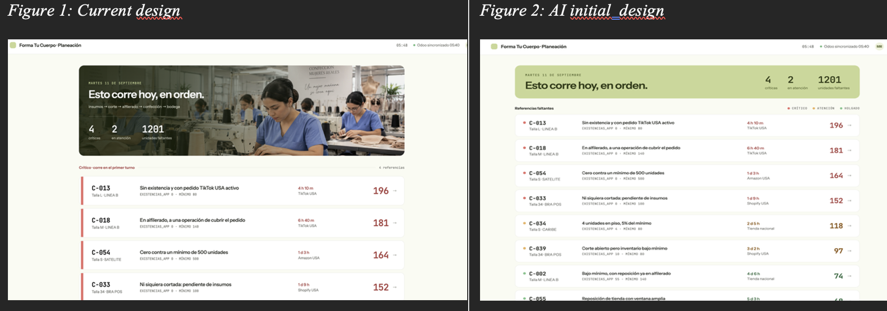

# FTC · Production Planning Prototype

This prototype helps a production planner at a Colombian shapewear manufacturer determine what needs to be produced first by combining order urgency, inventory shortages, and the current production stage into one prioritized workflow.

---

## 1. Need, Persona, Primary Capability, and Fundamental Value

### Need

Production planners must manually cross-reference each missing reference's production stage against order urgency before deciding what to produce first. TikTok orders may require approximately a 12-hour turnaround, retail stores may have about one week, and international orders may allow a few additional days.

Doing this manually for dozens of references every morning consumes time the planner does not have, especially because the same person also schedules work on the plant floor.

### Persona

A **production planner at a Colombian shapewear manufacturer** who reviews order shortfalls before 6:00 AM each day to determine what should run first, while also managing plant-floor scheduling.

### Primary Capability

See, at a glance, a **single ranked list of what to produce first**, without manually cross-referencing inventory, production stage, and order urgency for each reference.

### Fundamental Value

**Certainty and speed of decision.**

The planner starts the day already knowing what should run now and what can wait, instead of rebuilding the same judgment call from scratch every morning.

---

## 2. The Three Screens

The three screens represent one complete operational loop:

**See the priority → Understand why → Act on it**

### Screen 1 — Today's Run

**"Esto corre hoy, en orden."**

- **Single job:** Show the day's production priorities already ranked and grouped into **Critical, Attention, and Backlog**, with summary counts above the list.
- **Why it earned its slot:** This screen contains the core value proposition. Even if the planner only saw this screen, they would know what requires attention and what should run first.
- **Design question:** Does the landing screen communicate the primary capability and fundamental value before the planner reads an individual reference?

### Screen 2 — Why This Score

- **Single job:** Explain why a specific reference received its priority score using three factors: **production stage, order urgency, and inventory gap**, alongside the supporting record from Odoo.
- **Why it earned its slot:** A ranked list is only useful if the planner trusts it. The recommendation therefore needs to be explainable and auditable.
- **Design question:** Does the visual hierarchy separate the reason for the score from the supporting operational record?

### Screen 3 — Cover the Gap

- **Single job:** Let the planner act on a shortage by borrowing available units from another store or recording why a reference missed its production window.
- **Why it earned its slot:** This screen closes the workflow by moving from diagnosis to action rather than simply displaying more information.
- **Design question:** Is the primary action unambiguous, and does the screen remain visually consistent with the other two?

Together, these screens deliberately exclude login, permissions, settings, and other administrative functionality because those elements do not help examine the prototype's primary capability or fundamental value.

---

## 3. Design Question Plan

### Need

**Question:**  
> "Walk me through the last time you had to figure out what to run first thing in the morning. What did you actually end up doing?"

**Prediction:**  
The planner will describe manually reviewing Odoo shortfall information and cross-referencing inventory levels, shortages, and production status. They may also mention that this process consumes part of the limited early-morning planning window. This prediction relates directly to the manual work that **Today's Run** is intended to replace.

### Value

**Question:**  
> "If you never had to do that manual check again, what's the one or two words that come to mind for what that gives you?"

**Prediction:**  
The planner will answer with something close to **time, certainty, confidence, or peace of mind**. This prediction relates to the prototype's intended fundamental value of certainty and speed of decision.

### Persona

**Question:**  
> "How often does this shortfall check come up for you, and what are you usually juggling right before or after it?"

**Prediction:**  
The planner will describe the task as occurring daily and overlapping with plant-floor scheduling or other production-planning responsibilities. This prediction relates to the persona assumption that speed matters because the planner is balancing multiple responsibilities.

### Capability

**Question:**  
> "I'm going to show you this screen for five seconds, then hide it. What does this tool do?"

**Screen shown:** Today's Run

**Prediction:**  
The planner will respond with something similar to, **"It shows me what's most urgent to make today,"** without needing to explain individual fields or numbers. This prediction relates specifically to the headline, summary counts, ranked list, and urgency bands on **Today's Run**.

---

## 4. Design Justification and First Read

### First Read

The landing screen is designed to communicate the primary capability before the planner reads an individual reference.

The **date, headline, and three summary counts — Critical, Attention, and Units Missing —** appear before the detailed production list. This establishes a reading hierarchy:

**Today's state → Urgency → Individual references**

The planner should therefore understand that the interface is prioritizing today's production work before examining the underlying records.

Most elements on the landing screen directly support this job. The sewing-team image is the one deliberate exception: it communicates manufacturing context and brand identity rather than operational information. For that reason, it remains visually secondary and does not compete with the summary metrics or ranked list.

### Grouping and Gestalt Principles

**Common region:** The summary metrics are grouped within the same visual region so they are perceived as one conceptual unit: **the state of production today**. The ranked production list occupies a separate region below it.

**Similarity:** References within the same urgency category share consistent visual treatment. For example, rows in the same urgency band use the same colored indicator, allowing the planner to distinguish **Crítico** from **Atención** before reading every label.

**Continuity:** The production stages follow the actual physical movement of a garment through the manufacturing process:

**Insumos → Corte → Alfilerado → Confección → Bodega**

This sequence follows the planner's existing mental model and allows the interface to be read in the same direction that the product moves through the plant.

### Affordances and Signifiers

The store quantity control **affords increasing or decreasing the number of units borrowed from each location**. This allows the planner to combine available inventory from multiple stores when covering a shortage.

In the initial AI design, this affordance was poorly signified: the interface technically allowed quantity adjustment, but nothing clearly communicated how the planner should perform that action.

The revised design adds explicit **`+` and `−` controls** as signifiers. These controls communicate where and how the quantity can be changed, while the **live running total provides feedback** after the interaction.

In other words:

- **Affordance:** The quantity can be increased or decreased.
- **Signifier:** The `+` and `−` controls communicate how to perform that action.
- **Feedback:** The running total changes to confirm the result of the action.

### Screens 2 and 3 Stay on Mission

Both supporting screens are accessed from a specific reference on the priority list.

**Why This Score** only explains the priority of that reference, while **Cover the Gap** only provides actions for resolving its shortage. Neither screen introduces unrelated functionality.

The navigation therefore remains:

**Today's Run → Specific Reference → Explanation or Action**

All supporting screens provide a path back to **Today's Run**, keeping the ranked production list as the center of the workflow.

### What AI Got Wrong and What Changed

The initial AI-generated interface provided a useful starting point, but several decisions required human correction:

- **Continuity:** AI initially represented the production stages in reverse order, beginning near the finished product. I reordered them to match the physical manufacturing path: **Insumos → Corte → Alfilerado → Confección → Bodega**.
- **Signifiers:** The store quantity picker allowed adjustment but did not clearly communicate how. I added explicit `+` and `−` controls and live feedback.
- **Common region:** The initial landing page did not create enough visual separation between different types of information. I grouped the daily summary separately from the ranked production list so the planner's first read moves from overall status to individual priorities.

Each revision was motivated by a specific design question: whether the interface follows the planner's mental model, whether available actions are discoverable, and whether visual grouping communicates the primary capability before detailed reading.

### Before / After

**Before:** The necessary information was present, but weak **common region and visual hierarchy** caused summary information and detailed production information to compete for attention. It was less obvious where the planner should look first or which information belonged together.

**After:** Related information is organized into distinct visual regions. The daily summary receives stronger hierarchy, while the ranked production list occupies a separate region below it. This creates a clearer first read:

**Daily status → Urgency → Individual production reference**

The revision was therefore not simply an aesthetic change. It addressed a grouping and signaling problem that directly affected how quickly the planner could understand the screen's primary capability.

